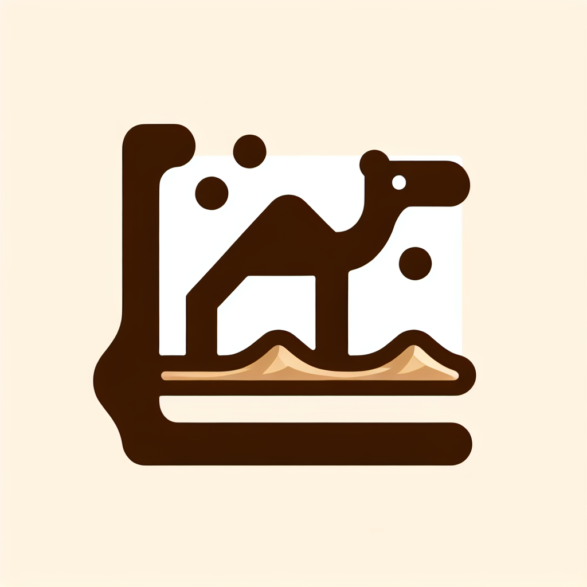

# ds-react-camel-ui

## 站在巨人的肩上，仅用来学习，fork自[camel-ui](camel-ui)



# 样式预览


# 使用方法
安装
```bash
$ npm i @ids-react/camel-ui
```

使用
```
import { Button } from '@ids-react/camel-ui';
import '@ids-react/camel-ui/dist/index.css';

<Button>按钮</Button>
```

参考`App.tsx`中每个组件的使用方法，基本都非常简单，每个组件1-3行代码。
# 组件列表
- badge
- button
- card
- checkbox
- combobox
- details
- dialog
- input
- input file
- radio
- select
- switch
- table
- tabs
- textarea
- tooltip
